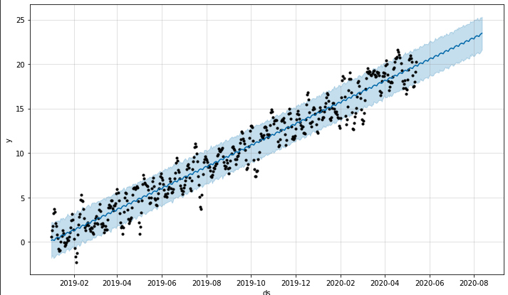

# Forecasting Net Profit for MercadoLibre
This analysis uses time series forecasting to analyze MercadoLibre's financial and user data to determine ways to make the company grow. One goal is to find out if the ability to predict search traffic can translate into the ability to successfully trade the stock. Another goal is to forecast the revenue of MercadoLibre by using time series models. 


---

## Technologies 
This analysis uses [Google Colab](https://colab.research.google.com/?utm_source=scs-index) and the standard Python 3.8 libraries. In addition, this project requires the following libraries and/or dependencies: 

* [pandas](https://pandas.pydata.org/) - a software library designed for open source data analysis and manipulation
* [hvplot](https://hvplot.holoviz.org/) - interactive plotting API that supports panning, zooming, hovering, and clickable/selectable legends
* [holoviews](https://holoviews.org/) - an open-source Python library designed to make data analysis and visualization seamless and simple
* [Prophet](https://facebook.github.io/prophet/) - a procedure for forecasting time series data based on an additive model where non-linear trends are fit with yearly, weekly, and daily seasonality, plus holiday effects
* [datetime](https://docs.python.org/3/library/datetime.html) - supplies classes for manipulating dates and times
* [numpy](https://numpy.org/) - a Python library that provides a multidimensional array object, various derived objects, and an assortment of routines for fast operations on arrays, including mathematical, logical, shape manipulation, sorting, selecting, I/O, discrete Fourier transforms, basic linear algebra, basic statistical operations, random simulation and much more
* [matplotlib](https://matplotlib.org/) - a cross-platform, data visualization and graphical plotting library for Python and its numerical extension NumPy

---

## Installation Guide

Before running the application, first install the following libraries in the first code cell:
```
!pip install pystan
!pip install fbprophet
!pip install hvplot
!pip install holoviews
```

---

## Usage
To interact with the analysis of forecasting net profit for MercadoLibre:
1. Clone the repository
`git clone https://github.com/ccroft6/Forecasting_Net_Profit.git`

2. Open a Google Colab notebook and upload the "forecasting_net_prophet.ipynb" file that you cloned 
**OR** 
Open the terminal at this repository location. Activate the environment and launch jupyter lab:
```
conda activate dev
jupyter lab 
```
*On some computers, Facebook Prophet does not work well in Jupyter Lab. Therefore, Google Colab is offered as an alternative way to use Facebook Prophet without any issues.*

---

## Methods
The following steps were taken for this analysis:
1. Find unusual patterns in hourly Google search traffic
2. Mine the search traffic data for seasonality
3. Relate the search traffic to stock price patterns
4. Create a time series model with Prophet
5. Forecast revenue by using time series models

---

## Contributors
Catherine Croft

Email: catherinecroft1014@gmail.com

LinkedIn: [catherine-croft](https://www.linkedin.com/in/catherine-croft-4715481aa/)

---

## License 
MIT

